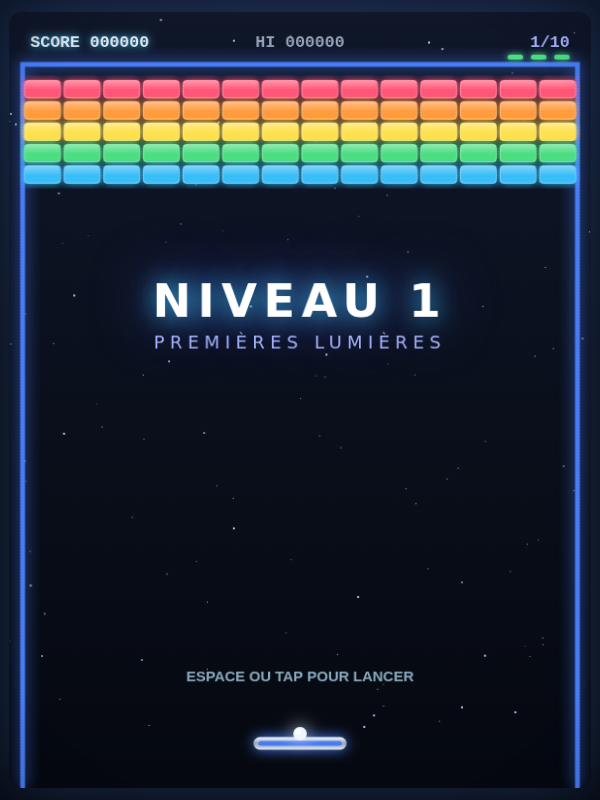

# 🧱 NÉONOID

**Casse-briques néon — hommage à l'Amiga**

Un jeu de casse-briques (Breakout/Arkanoid) au style néon synthwave, avec starfield, effets de lueur, combos, bonus/malus et 10 niveaux progressifs. Jouable au clavier, à la souris ou au tactile sur mobile.

🎮 **Jouer :** [neonoid.lhusser.fr](https://neonoid.lhusser.fr) · [GitHub Pages](https://laurent-67370.github.io/neonoid/)



---

## ✨ Fonctionnalités

- **10 niveaux** uniques avec des motifs variés : damier, pyramide, donjon, envahisseur, galaxie, cœur, escaliers, cible, noyau final…
- **7 bonus** (capsules à attraper) : palet élargi, multi-balles ×3, lasers, palet collant, balle ralentie, boule de feu, vie supplémentaire
- **2 malus** : palet rétréci, balle accélérée
- **Briques spéciales** : argentées (2-3 coups), dorées (indestructibles), explosives (chaîne)
- **Système de combos** jusqu'à ×8 pour un maximum de points
- **High scores** — top 5 avec nom du joueur (sauvegarde locale)
- **Effets visuels néon** : starfield animé, trail de balle, particules d'explosion, lueur bloom
- **Audio** généré par Web Audio API (aucun fichier son requis)
- **100% vanilla JS** — aucune dépendance, aucun build, ça tourne directement dans le navigateur

---

## 🎮 Contrôles

| Action | Clavier | Souris / Tactile |
|---|---|---|
| Déplacer le palet | `←` `→` ou `A` `D` | Glisser |
| Lancer la balle / Tirer | `Espace` | Clic / Tap |
| Pause | `P` ou `Échap` | — |
| Activer/désactiver le son | `M` | — |

---

## 🧱 Types de briques

| Symbole | Type | Effet |
|---|---|---|
| Couleur | Normale | Détruite en 1 coup |
| S | Argentée | 2 coups (3 en fin de jeu) |
| G | Dorée | Indestructible |
| X | Explosive | Détruit les briques voisines en chaîne |

---

## 🎁 Bonus & Malus

| Capsule | Effet |
|---|---|
| **E** 🔵 | Palet élargi |
| **M** 🟣 | Multi-balles ×3 |
| **L** 🩷 | Lasers (Espace pour tirer) |
| **C** 🟢 | Palet collant |
| **S** 🔵 | Balle ralentie |
| **B** 🟠 | Boule de feu (traverse les briques) |
| **+** 🩷 | Vie supplémentaire ❤ |
| **!** 🔴 | Palet rétréci (malus) |
| **F** 🟡 | Balle accélérée (malus) |

---

## 📁 Structure du projet

```
neonoid/
├── index.html        # Structure HTML + écrans (titre, aide, scores, pause, fin)
├── css/
│   └── style.css     # Styles néon, écrans, boutons, animations
├── js/
│   ├── audio.js      # Web Audio API — sons générés (rebonds, explosions, bonus)
│   ├── levels.js     # Définition des 10 niveaux (maps en caractères)
│   ├── game.js       # Moteur du jeu (physique, collisions, briques, bonus, particules)
│   ├── ui.js         # Gestion des écrans, boutons, high scores, bannières
│   └── main.js       # Point d'entrée, boucle de jeu (requestAnimationFrame)
└── test-neonoid.cjs  # Test Playwright (headless)
```

---

## 🚀 Déploiement

### Local
Ouvrir `index.html` dans un navigateur — c'est tout.

### GitHub Pages
Le dépôt est configuré pour GitHub Pages (branche `main` / root) :
→ https://laurent-67370.github.io/neonoid/

### VPS (nginx + Let's Encrypt)
```bash
git clone https://github.com/Laurent-67370/neonoid.git /var/www/neonoid
# Config nginx → neonoid.lhusser.fr → /var/www/neonoid
certbot --nginx -d neonoid.lhusser.fr
```
Auto-update toutes les 10 min via cron (`/opt/neonoid-update.sh`).

---

## 🛠️ Tech

- **HTML5 Canvas** 600×800
- **Vanilla JavaScript** (ES5, aucune dépendance)
- **Web Audio API** pour le son
- **localStorage** pour les high scores
- Compatible mobile (viewport, touch events)

---

## 📜 Licence

Projet personnel — Laurent Husser